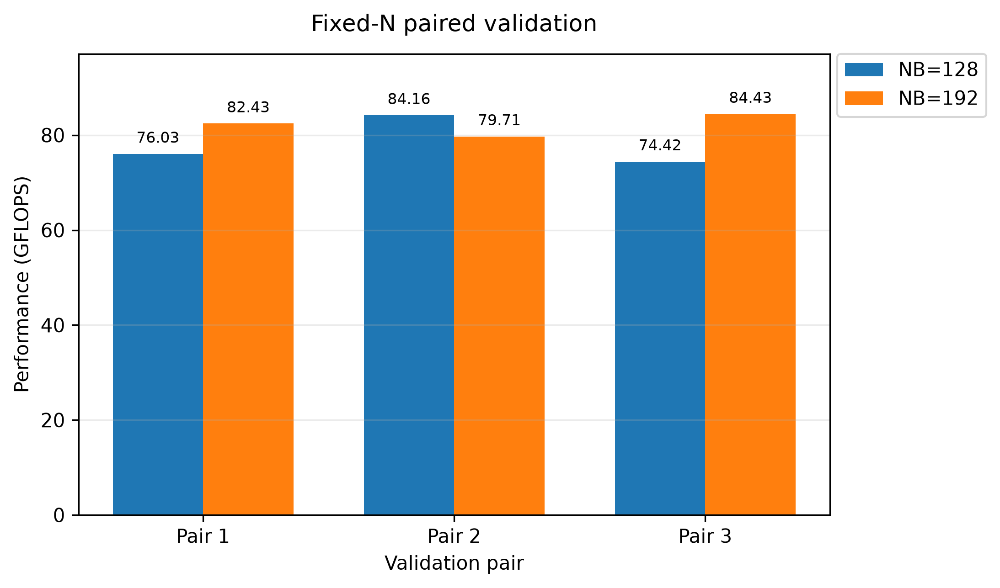
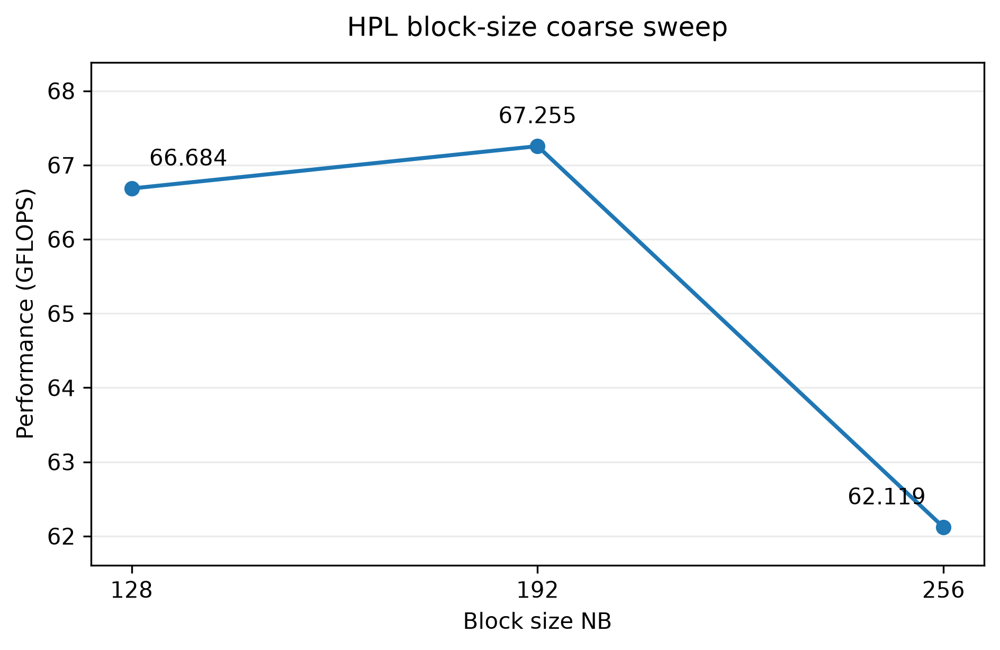
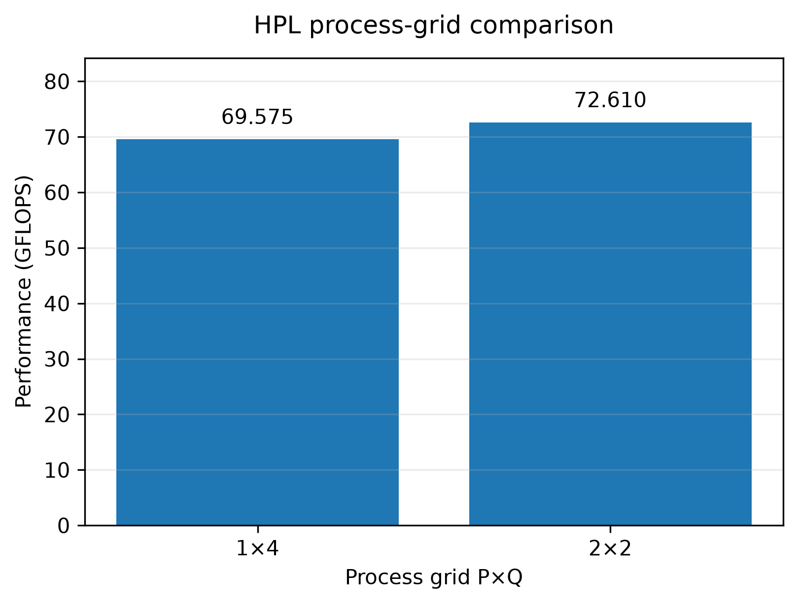
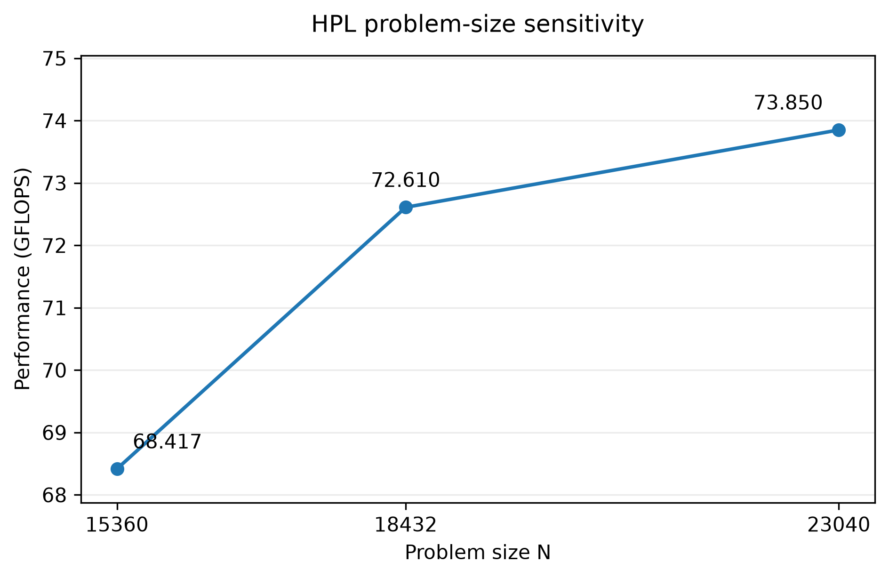
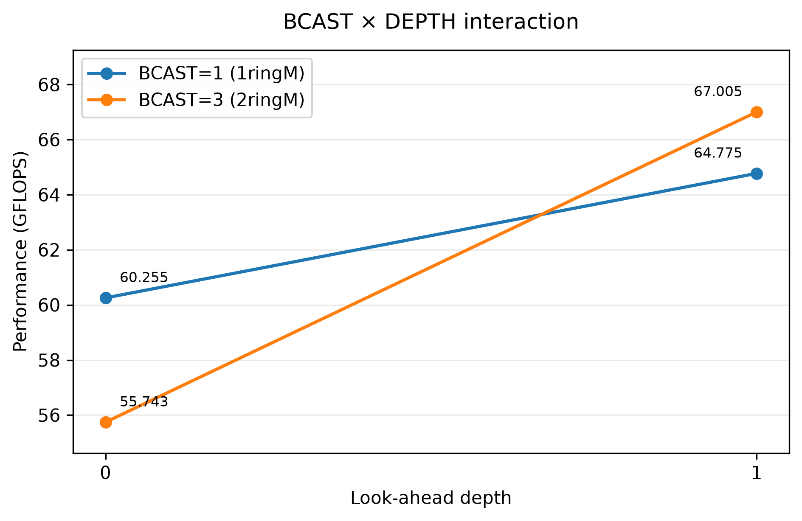

# ASC Selection Homework — HPL Performance Optimization

## Submission Information

- 姓名：张嘉
- 年级专业：25级计算机科学与技术专业1班
- 对应题目：基础题 — HPL
- 运行环境：Windows 11 + WSL2 Ubuntu 26.04 LTS；Intel Core i7-10510U；Open MPI 5.0.10；OpenBLAS 0.3.32；GCC/GFortran 15.2.0。详细信息见 [Hardware and Software Environment](#2-hardware-and-software-environment)。
- 完成情况：已完成 HPL 环境搭建、编译运行、Baseline、至少三组参数实验、NB / MPI process grid / problem size / BCAST × DEPTH 调优、正确性验证、重复实验、性能波动分析、DGEMM 性能参考、结果可视化与复现整理。
- 复现方式：见 [Build](#4-build)、[Runtime Configuration](#5-runtime-configuration)、[Reproducing an HPL Run](#15-reproducing-an-hpl-run) 和 [Reproducing the Analysis and Figures](#16-reproducing-the-analysis-and-figures)。

本仓库记录 ASC 选拔作业基础题 **HPL 性能优化** 的完整实践过程，包括环境配置、Baseline、参数搜索、正确性验证、重复实验、性能上限分析和可复现脚本。

HPL 使用官方 Netlib HPL 2.3。上游 HPL 计算源码未修改，本实验主要工作集中在：

- MPI / OpenBLAS 构建与运行环境；
- `HPL.dat` 参数调优；
- MPI rank、CPU affinity 与线程配置；
- 正确性与重复性验证；
- 性能上限和运行波动分析；
- 可复现实验记录与数据可视化。

源码来源及本地修改范围见 [`SOURCE.md`](SOURCE.md)。

---

## 1. Main Result

本实验最主要、经过重复验证的优化为：

- `N = 18432`
- `P × Q = 2 × 2`
- `4 MPI ranks`
- `1 OpenBLAS thread / rank`
- 对比 `NB = 128` 与 `NB = 192`

三组 fixed-N paired validation：

| Pair | NB=128 (GFLOPS) | NB=192 (GFLOPS) |
|---|---:|---:|
| 1 | 76.029 | 82.429 |
| 2 | 84.164 | 79.708 |
| 3 | 74.418 | 84.430 |
| **Mean** | **78.204** | **82.189** |

因此：

**NB=192 相对 NB=128 的平均性能提升为 5.10%。**

NB=192 三次测试平均性能为 **82.189 GFLOPS**，最高单次观察值为 **84.430 GFLOPS**。



三组配对实验中 NB=192 赢得两组，NB=128 赢得一组。因此本仓库使用完整重复实验及平均值作为主要优化证据，而不是仅选择单次最高性能。

---

## 2. Hardware and Software Environment

### Hardware

- CPU: Intel Core i7-10510U
- Physical cores: 4
- Logical CPUs: 8
- SIMD: AVX2
- FMA: supported
- Host memory: approximately 16 GB
- WSL2 memory: approximately 7.7 GiB

### Software

- OS: Ubuntu 26.04 LTS under WSL2
- HPL: 2.3
- GCC: 15.2.0
- GFortran: 15.2.0
- Open MPI: 5.0.10
- OpenBLAS: 0.3.32 pthread

完整环境记录：

- [`results/system_info.txt`](results/system_info.txt)
- [`results/software_info.txt`](results/software_info.txt)
- [`results/linked_libraries.txt`](results/linked_libraries.txt)
- [`results/thread_env.txt`](results/thread_env.txt)
- [`results/mpi_binding.txt`](results/mpi_binding.txt)

---

## 3. HPL Algorithm and Tuning Targets

HPL 求解稠密线性方程组：

```text
A x = b
```

核心计算为带部分主元选取的 LU 分解，并通过二维 block-cyclic distribution 将矩阵分布到 `P × Q` MPI process grid。

主要执行阶段可概括为：

1. panel factorization；
2. panel broadcast；
3. row interchange；
4. trailing matrix update；
5. 进入下一 panel；
6. 最终 triangular solve。

trailing matrix update 中包含大量 BLAS Level-3 / DGEMM 运算，因此矩阵 blocking、BLAS kernel 效率、MPI 数据分布以及 panel 通信方式都会影响最终 GFLOPS。

本实验主要研究以下参数：

| Parameter | Meaning | Main performance concern |
|---|---|---|
| `N` | Problem size | Memory utilization and BLAS-3 ratio |
| `NB` | Block size | Cache/blocking and BLAS efficiency |
| `P × Q` | MPI process grid | Data distribution and communication |
| `BCAST` | Panel broadcast algorithm | Communication pattern |
| `DEPTH` | Look-ahead depth | Critical-path overlap |

实验采用 **coarse-to-fine** 策略，而不是遍历全部 HPL 参数组合。

---

## 4. Build

官方 HPL 2.3：

<https://www.netlib.org/benchmark/hpl/>

本仓库不复制完整 upstream HPL source。复现时首先下载并解压 HPL 2.3。

假设 HPL 根目录为：

```bash
export HPL_ROOT=/path/to/hpl-2.3
```

将本仓库构建配置复制进去：

```bash
cp build/Make.WSL "$HPL_ROOT/Make.WSL"
```

由于 `Make.WSL` 中的 `TOPdir` 来自原实验机器，其他机器复现时需将其改为实际 HPL 根目录：

```bash
sed -i "s|^TOPdir[[:space:]]*=.*|TOPdir       = $HPL_ROOT|" \
  "$HPL_ROOT/Make.WSL"
```

然后串行编译：

```bash
cd "$HPL_ROOT"
make arch=WSL
```

实验中曾尝试：

```bash
make arch=WSL -j4
```

但旧 HPL build system 在初始化目录阶段出现 parallel-build race，因此正式构建改为：

```bash
make arch=WSL
```

串行构建成功。

---

## 5. Runtime Configuration

所有正式测试统一设置：

```bash
export OMP_NUM_THREADS=1
export OPENBLAS_NUM_THREADS=1
```

HPL 正式运行命令：

```bash
mpirun -np 4 \
  --map-by core \
  --bind-to core \
  --mca btl self,sm \
  ./xhpl
```

设计理由：

- CPU 有 4 个 physical cores，因此使用 4 MPI ranks；
- 每个 rank 使用 1 个 OpenBLAS thread，避免 MPI × BLAS oversubscription；
- `--bind-to core` 将 MPI rank 固定到 CPU core；
- 所有 rank 位于同一 WSL2 VM，因此使用 local/shared-memory transport。

实际 MPI binding 记录：

[`results/mpi_binding.txt`](results/mpi_binding.txt)

---

## 6. Baseline

Baseline 配置：

```text
N  = 18432
NB = 128
P  = 2
Q  = 2
```

配置文件：

[`configs/HPL_baseline.dat`](configs/HPL_baseline.dat)

第一次正式 Baseline：

```text
Time:        57.87 s
Performance: 72.149 GFLOPS
Correctness: PASSED
```

Baseline 用于建立后续参数搜索的参考。由于平台存在明显运行间波动，不将该单次结果直接作为稳定机器性能。


---

## 7. Block Size NB

### 7.1 Coarse Sweep

固定：

```text
N = 18432
P × Q = 2 × 2
```

粗搜索结果：

| NB | GFLOPS | Correctness |
|---:|---:|---|
| 128 | 66.684 | PASSED |
| 192 | 67.255 | PASSED |
| 256 | 62.119 | PASSED |



`NB=256` 性能明显下降，而 `NB=128` 与 `NB=192` 的差距较小，因此 coarse sweep 本身不足以证明 `NB=192` 稳定更优。

随后继续进行了独立 confirmation 和 fixed-N paired validation。

### 7.2 Fixed-N Paired Validation

保持：

```text
N     = 18432
P × Q = 2 × 2
np    = 4
```

只改变 `NB`。

重复实验：

```text
NB=128:
76.029
84.164
74.418 GFLOPS

mean   = 78.204 GFLOPS
median = 76.029 GFLOPS
CV     = 6.68%
```

```text
NB=192:
82.429
79.708
84.430 GFLOPS

mean   = 82.189 GFLOPS
median = 82.429 GFLOPS
CV     = 2.88%
```

平均性能提升：

```text
82.189 / 78.204 - 1 = 5.10%
```

因此将：

```text
NB = 192
```

作为本实验的 **validated choice**。

三组 paired run 中 NB=192 赢得两组、NB=128 赢得一组，因此这里的结论是“重复实验平均性能更高”，而不是声称 `NB=192` 在每一次运行中都必然更快。

原始数据：

[`results/fixedN_validation.csv`](results/fixedN_validation.csv)

---

## 8. MPI Process Grid

固定：

```text
N  = 18432
NB = 192
np = 4
```

比较：

| P × Q | GFLOPS | Correctness |
|---|---:|---|
| 1 × 4 | 69.575 | PASSED |
| 2 × 2 | 72.610 | PASSED |



在该次实验中：

```text
2 × 2 : 72.610 GFLOPS
1 × 4 : 69.575 GFLOPS
```

较平衡的 `2 × 2` process grid 表现更好，因此后续实验保留：

```text
P × Q = 2 × 2
```

需要说明的是，该结论来自当前机器、当前 HPL workload 和 4-rank 设置，不意味着 `2 × 2` 对所有硬件和进程数都固定最优。

---

## 9. Problem-Size Sensitivity

固定：

```text
NB = 192
P × Q = 2 × 2
```

结果：

| N | GFLOPS | Correctness |
|---:|---:|---|
| 15360 | 68.417 | PASSED |
| 18432 | 72.610 | PASSED |
| 23040 | 73.850 | PASSED |



在该组 problem-size sweep 中，`N=23040` 获得最高 throughput：

```text
73.850 GFLOPS
```

`N=23040` 的矩阵主体内存规模约为：

```text
8 × N² ≈ 3.96 GiB
```

运行过程中未使用 swap，因此这一规模仍处于本机 WSL2 可接受的内存范围。

需要特别说明：

**改变 N 同时改变了实际 workload，因此这里展示的是 problem-size sensitivity，而不是相同工作量下的 speedup。**

---

## 10. BCAST × DEPTH Algorithm-Level Exploration

最后进行一个小型 `2 × 2` factorial experiment：

```text
BCAST ∈ {1, 3}
DEPTH ∈ {0, 1}
```

固定：

```text
N     = 18432
NB    = 192
P × Q = 2 × 2
np    = 4
```

结果：

| BCAST | DEPTH | GFLOPS | Correctness |
|---:|---:|---:|---|
| 1 | 0 | 60.255 | PASSED |
| 1 | 1 | 64.775 | PASSED |
| 3 | 0 | 55.743 | PASSED |
| 3 | 1 | 67.005 | PASSED |



在该次 mini-sweep 中：

```text
BCAST = 3
DEPTH = 1
```

取得最高值：

```text
67.005 GFLOPS
```

相对同一 session 中：

```text
BCAST = 1
DEPTH = 0
60.255 GFLOPS
```

提升：

```text
67.005 / 60.255 - 1 ≈ 11.20%
```

同时观察到：

- `DEPTH=1` 在两种 BCAST 设置下都高于 `DEPTH=0`；
- 在 `DEPTH=0` 时，`BCAST=3` 低于 `BCAST=1`；
- 在 `DEPTH=1` 时，`BCAST=3` 高于 `BCAST=1`；
- 因此 BCAST 的影响会随 DEPTH 改变，表现出明显的 parameter interaction。

但是每个组合仅测试一次，而且机器存在明显 run-to-run variation，因此这一部分定义为：

**exploratory algorithm-level result**

而不是：

**validated stable speedup**。

主要经过重复验证的 HPL 配置仍然是：

```text
N     = 18432
NB    = 192
P × Q = 2 × 2
BCAST = 1
DEPTH = 0
```

---

## 11. Correctness

所有保留的正式 HPL 实验均通过 HPL scaled residual check：

```text
PASSED
```

HPL 使用类似以下 scaled residual 进行数值正确性判断：

```text
||Ax-b||_oo /
(eps * (||A||_oo * ||x||_oo + ||b||_oo) * N)
```

本实验中的典型 scaled residual 约为 `10^-3` 量级，远低于 HPL 判定阈值。

因此性能调优过程中没有以牺牲数值正确性为代价。

对应原始输出保存在：

[`logs/`](logs/)

例如：

- baseline；
- NB coarse sweep；
- NB confirmation；
- process-grid comparison；
- problem-size sweep；
- fixed-N validation；
- BCAST × DEPTH sweep。

---

## 12. Performance Variability

本实验过程中最明显的实践问题之一是：

**相同或相近配置在不同时间窗口下的 GFLOPS 存在较明显波动。**

因此实验方法逐步从：

```text
single-run observation
```

升级为：

```text
single-run observation
→ independent confirmation
→ cooldown
→ fixed-N paired validation
→ reversed-order pair
→ mean / median / CV
```

正式实验统一控制：

- MPI rank 数；
- OpenBLAS/OpenMP thread 数；
- CPU core binding；
- HPL workload；
- process grid；
- 测试间 cooldown。

持续负载 validation 数据：

[`results/final_validation.csv`](results/final_validation.csv)

其中不同时间段的绝对 GFLOPS 存在较明显变化。因此本报告不跨 session 简单比较单次最高值，而优先使用：

```text
same workload
+
same runtime configuration
+
paired/repeated measurements
```

作为性能判断依据。

可能影响性能的因素包括：

- CPU dynamic frequency；
- power state；
- thermal state；
- Windows host scheduling；
- WSL2 scheduling。

但本实验没有额外的硬件频率、功耗或温度遥测，因此不将观察到的波动唯一归因于某一种机制。

---

## 13. Nominal Rpeak and DGEMM Reference

### 13.1 Nominal Base-Frequency Rpeak

Intel Core i7-10510U 支持 AVX2 和 FMA。

一个 256-bit AVX2 vector 可包含：

```text
4 FP64 values
```

FMA 对每个元素完成一次乘法和一次加法：

```text
2 FLOPs / element
```

按每核心两个 256-bit FMA execution units 估算：

```text
4 doubles/vector
× 2 FLOPs/FMA
× 2 vector FMA units
= 16 FP64 FLOP/cycle/core
```

使用：

```text
4 physical cores
× 1.80 GHz base frequency
× 16 FP64 FLOP/cycle/core
```

得到 nominal base-frequency Rpeak：

```text
115.2 GFLOPS
```

validated HPL mean 为：

```text
82.189 GFLOPS
```

因此：

```text
82.189 / 115.2 ≈ 71.3%
```

即 validated HPL mean 约达到 nominal base-frequency Rpeak 的：

**71.3%**

这里的 `115.2 GFLOPS` 只是基于 base frequency 的 nominal reference，并不是 CPU 在 Turbo、功耗和温度动态状态下的严格持续物理峰值。

### 13.2 OpenBLAS DGEMM Empirical Reference

为了进一步了解当前 OpenBLAS 数学 kernel 的实际吞吐，本实验额外实现 MPI + CBLAS DGEMM microbenchmark，并保持与 HPL 类似的运行模型：

```text
4 MPI ranks
1 OpenBLAS thread / rank
core binding
```

size sweep 中最高观察到：

```text
86.478 GFLOPS
```

因此：

```text
82.189 / 86.478 ≈ 95.0%
```

即 validated HPL mean 约为 best-observed DGEMM throughput 的：

**95.0%**

但是后续对 `N=4096` DGEMM 进行三次重复：

```text
79.418
78.870
79.475 GFLOPS
```

得到：

```text
mean   ≈ 79.254 GFLOPS
median ≈ 79.418 GFLOPS
CV     ≈ 0.42%
```

这说明同一时间窗口内 DGEMM 可以非常稳定，但不同时间窗口之间仍可能对应不同的 CPU performance state。

因此：

```text
86.478 GFLOPS
```

只被视为：

**best-observed empirical DGEMM reference**

而不是严格的 physical performance ceiling。

DGEMM 源码和测试结果：

[`analysis/dgemm/`](analysis/dgemm/)


---

## 14. Final Results

主要实验结果汇总如下：

| Metric | Result |
|---|---:|
| Initial baseline | 72.149 GFLOPS |
| Fixed-N NB=128 mean | 78.204 GFLOPS |
| Fixed-N NB=192 mean | **82.189 GFLOPS** |
| Validated mean improvement | **5.10%** |
| Highest single HPL observation | **84.430 GFLOPS** |
| Nominal base-frequency Rpeak | 115.2 GFLOPS |
| HPL mean / nominal Rpeak | **71.3%** |
| Best observed DGEMM | 86.478 GFLOPS |
| HPL mean / DGEMM empirical reference | **95.0%** |
| B3D1 vs B1D0 in advanced mini-sweep | **+11.20% exploratory** |

其中需要区分三种不同性质的结果：

1. **Validated optimization**  
   固定 workload 下，`NB=192` 相对 `NB=128` 的 repeated mean improvement 为 **5.10%**。

2. **Highest observed HPL performance**  
   所有保留实验中的最高单次 HPL observation 为 **84.430 GFLOPS**。

3. **Exploratory advanced tuning result**  
   `BCAST=3, DEPTH=1` 在单次 mini-sweep session 中相对 `BCAST=1, DEPTH=0` 高 **11.20%**，但未进行重复验证，因此不作为最终稳定 speedup。

自动统计结果：

[`results/final_statistics.csv`](results/final_statistics.csv)

实验分析摘要：

[`results/hpl_analysis_summary.txt`](results/hpl_analysis_summary.txt)

---

## 15. Reproducing an HPL Run

### 15.1 Obtain HPL

从 Netlib 获取 HPL 2.3：

<https://www.netlib.org/benchmark/hpl/>

解压后假设其目录为：

```bash
export HPL_ROOT=/path/to/hpl-2.3
```

### 15.2 Apply Build Configuration

将本仓库提供的构建配置复制到 HPL 根目录：

```bash
cp build/Make.WSL "$HPL_ROOT/Make.WSL"
```

因为测试版 `Make.WSL` 中的 `TOPdir` 保存的是原实验机器路径，复现时应改为当前 HPL 根目录：

```bash
sed -i "s|^TOPdir[[:space:]]*=.*|TOPdir       = $HPL_ROOT|" \
  "$HPL_ROOT/Make.WSL"
```

编译：

```bash
cd "$HPL_ROOT"
make arch=WSL
```

### 15.3 Runtime Environment

正式运行前：

```bash
export OMP_NUM_THREADS=1
export OPENBLAS_NUM_THREADS=1
```

### 15.4 Baseline

从本仓库根目录执行：

```bash
cp configs/HPL_baseline.dat \
  "$HPL_ROOT/bin/WSL/HPL.dat"
```

然后：

```bash
cd "$HPL_ROOT/bin/WSL"

mpirun -np 4 \
  --map-by core \
  --bind-to core \
  --mca btl self,sm \
  ./xhpl
```

### 15.5 Validated NB=192 Configuration

从本仓库根目录执行：

```bash
cp configs/HPL_nb192_confirm.dat \
  "$HPL_ROOT/bin/WSL/HPL.dat"
```

然后使用相同 runtime command：

```bash
cd "$HPL_ROOT/bin/WSL"

mpirun -np 4 \
  --map-by core \
  --bind-to core \
  --mca btl self,sm \
  ./xhpl
```

完整重复实验脚本位于：

[`scripts/`](scripts/)

包括：

- `run_fixedN_validation.sh`
- `run_final_validation.sh`
- `run_bcast_depth_sweep.sh`

---

## 16. Reproducing the Analysis and Figures

本仓库的统计图不是手工制作，而是从 CSV 数据自动生成。

建议创建独立 Python environment：

```bash
python3 -m venv .venv-report
source .venv-report/bin/activate
```

安装依赖：

```bash
python -m pip install -r analysis/requirements.txt
```

运行：

```bash
python analysis/make_figures.py
```

该脚本重新读取实验 CSV，计算：

- repeated mean；
- median；
- coefficient of variation；
- fixed-N improvement；
- nominal Rpeak ratio；
- DGEMM empirical-reference ratio；
- BCAST × DEPTH exploratory effects。

生成：

```text
results/final_statistics.csv

figures/fig1_nb_coarse_sweep.png
figures/fig2_fixedN_nb_validation.png
figures/fig3_process_grid.png
figures/fig4_problem_size.png
figures/fig5_bcast_depth_interaction.png
```

因此主要结果遵循以下 provenance chain：

```text
HPL.dat
→ HPL execution
→ raw log
→ CSV
→ automated statistics
→ figure
→ README / report conclusion
```

---

## 17. Repository Structure

```text
.
├── README.md
├── SOURCE.md
├── .gitignore
│
├── build/
│   └── Make.WSL
│
├── configs/
│   ├── HPL_original.dat
│   ├── HPL_smoke.dat
│   ├── HPL_baseline.dat
│   ├── HPL_nb_sweep.dat
│   ├── HPL_nb128_confirm.dat
│   ├── HPL_nb192_confirm.dat
│   ├── HPL_grid_1x4.dat
│   ├── HPL_n15360.dat
│   ├── HPL_n23040.dat
│   └── HPL_bcast*_depth*.dat
│
├── scripts/
│   ├── run_fixedN_validation.sh
│   ├── run_final_validation.sh
│   └── run_bcast_depth_sweep.sh
│
├── results/
│   ├── results.csv
│   ├── fixedN_validation.csv
│   ├── final_validation.csv
│   ├── bcast_depth_sweep.csv
│   ├── final_statistics.csv
│   ├── hpl_analysis_summary.txt
│   ├── system_info.txt
│   ├── software_info.txt
│   ├── linked_libraries.txt
│   ├── thread_env.txt
│   └── mpi_binding.txt
│
├── logs/
│   └── raw HPL output logs
│
├── analysis/
│   ├── make_figures.py
│   ├── requirements.txt
│   └── dgemm/
│       ├── mpi_dgemm_ceiling.c
│       ├── dgemm_summary.csv
│       ├── dgemm_size_sweep.log
│       ├── dgemm_repeat.log
│       ├── performance_summary.txt
│       └── cpu_peak_info.txt
│
└── figures/
    ├── fig1_nb_coarse_sweep.png
    ├── fig2_fixedN_nb_validation.png
    ├── fig3_process_grid.png
    ├── fig4_problem_size.png
    └── fig5_bcast_depth_interaction.png
```

---

## 18. Troubleshooting and Lessons Learned

### 18.1 Parallel Build Race

最初尝试：

```bash
make arch=WSL -j4
```

时，legacy HPL build process 在初始化部分目录时发生 race，产生 missing-directory / copy error。

改为：

```bash
make arch=WSL
```

后串行构建成功。

这说明不能仅因为机器拥有多个 CPU cores，就默认所有旧 Makefile 都是 parallel-safe。

### 18.2 Open MPI Local Transport

初始运行曾出现 TCP interface 相关 warning。

由于所有 MPI ranks 均运行在同一个 WSL2 VM 中，最终运行命令使用：

```bash
--mca btl self,sm
```

限定 local/self 和 shared-memory transport。

### 18.3 MPI and BLAS Oversubscription

CPU 有 4 physical cores。

因此正式配置采用：

```text
4 MPI ranks
×
1 OpenBLAS thread per rank
```

即总共 4 个主要计算执行流。

若每个 MPI rank 再默认启动多个 BLAS threads，则会形成：

```text
MPI ranks × BLAS threads
```

造成 oversubscription，增加 scheduling overhead 和 performance variability。

### 18.4 Performance Variation

该平台实验过程中存在明显的 run-to-run variation。

因此实验方法逐步升级：

```text
single run
→ coarse sweep
→ independent confirmation
→ cooldown
→ paired validation
→ reversed execution order
→ mean / median / CV
```

这也是最终报告明确区分以下三类结果的原因：

```text
validated result
exploratory result
highest observed result
```

### 18.5 Different N Is Not Same-Workload Speedup

扩大 `N` 后 GFLOPS 上升，并不意味着程序完成了相同计算任务却运行得更快。

因为 HPL 的计算复杂度近似：

```text
O(N^3)
```

因此改变 `N` 会同时改变问题规模和实际工作量。

所以本仓库将 N sweep 描述为：

```text
problem-size sensitivity
```

而不是：

```text
speedup
```

### 18.6 Empirical DGEMM Is Not a Strict Ceiling

最高 DGEMM observation 为：

```text
86.478 GFLOPS
```

但另一个时间窗口下重复 DGEMM 稳定在约：

```text
79 GFLOPS
```

因此不同时间窗口的 CPU dynamic state 会影响结果。

所以 DGEMM 数据只作为：

```text
empirical performance reference
```

而不是严格 physical ceiling。

---

## 19. Conclusion

本实验采用了一个由粗到细的 HPL performance-engineering workflow：

```text
Environment setup
→ Correctness smoke test
→ Baseline
→ NB coarse search
→ NB confirmation
→ process-grid comparison
→ problem-size sensitivity
→ fixed-N repeated validation
→ sustained-load variability analysis
→ nominal Rpeak / DGEMM reference
→ BCAST × DEPTH exploration
→ stop tuning
```

主要经过重复验证的配置为：

```text
N     = 18432
NB    = 192
P × Q = 2 × 2
np    = 4

OMP_NUM_THREADS      = 1
OPENBLAS_NUM_THREADS = 1
```

fixed-N repeated validation 得到：

```text
NB=128 mean = 78.204 GFLOPS
NB=192 mean = 82.189 GFLOPS
```

对应：

**5.10% mean performance improvement under the same workload.**

最高单次 HPL observation 为：

**84.430 GFLOPS**

validated HPL mean 相对：

```text
115.2 GFLOPS
```

nominal base-frequency Rpeak 的比例约为：

**71.3%**

validated HPL mean 相对：

```text
86.478 GFLOPS
```

best-observed DGEMM empirical reference 的比例约为：

**95.0%**

高级参数 mini-sweep 中还观察到 BCAST 与 DEPTH 的 interaction，但由于缺少重复测试，将其保留为 exploratory evidence，而不升级为最终稳定优化结论。

本实验最终得到的主要经验是：

**HPL 调优不能只寻找一次最高 GFLOPS，而需要结合算法结构、硬件资源、MPI/BLAS runtime、控制变量实验、正确性验证、重复测试以及可复现证据链。**

完整的 configs、raw logs、CSV、统计脚本、环境信息和 figures 均保存在本仓库中。
