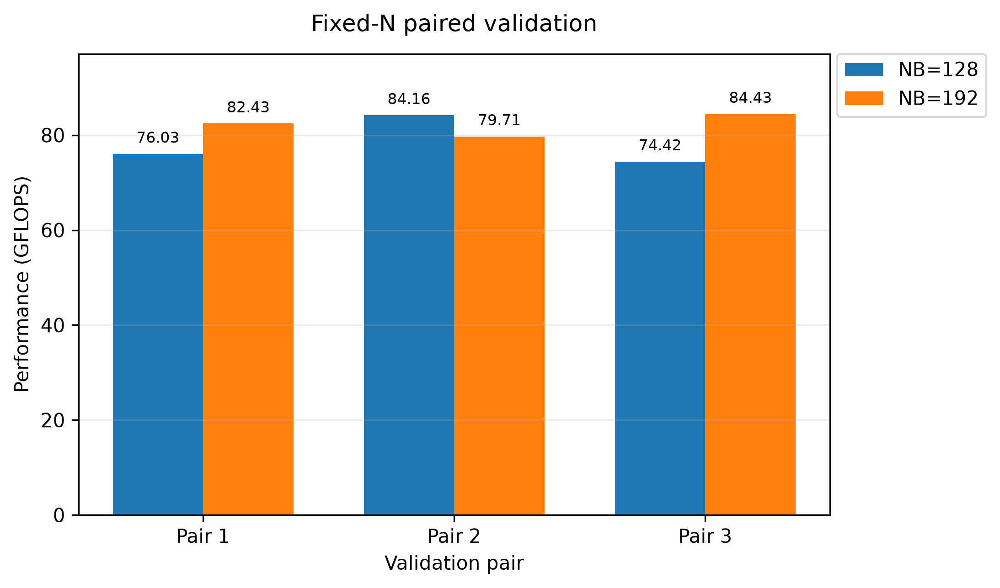
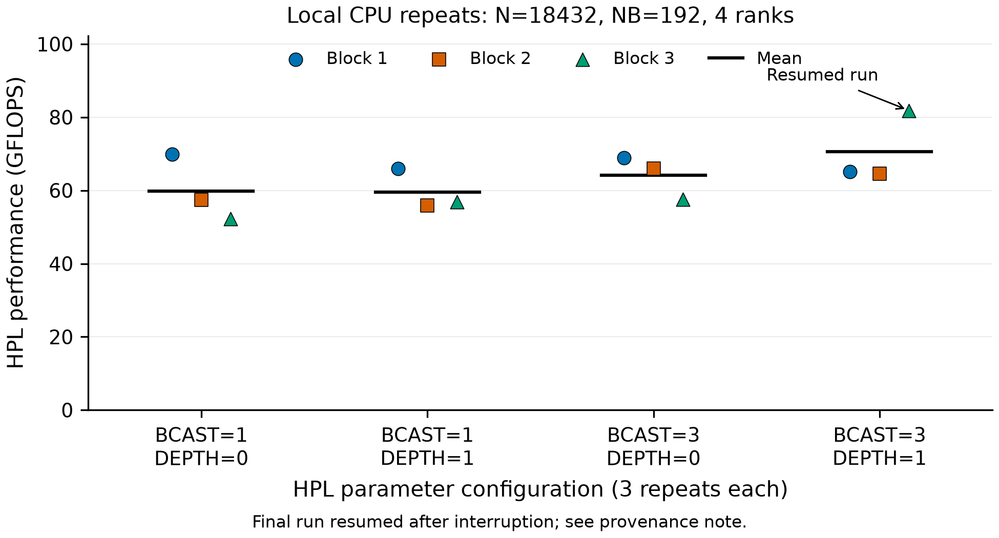

# ASC Selection Homework Submission — HPL

## 1. 基本信息

- 姓名：张嘉
- 年级专业：25级计算机科学与技术专业1班
- 对应题目：基础题 — HPL

---

## 2. 运行环境

### Hardware

- CPU: Intel Core i7-10510U
- Physical cores: 4
- Logical CPUs: 8
- Host memory: approximately 16 GB
- WSL2 memory: approximately 7.7 GiB

### Software

- Host OS: Windows 11
- Runtime environment: WSL2 Ubuntu 26.04 LTS
- HPL: Netlib HPL 2.3
- GCC / GFortran: 15.2.0
- Open MPI: 5.0.10
- OpenBLAS: 0.3.32 pthread

详细环境记录见：

- [`results/system_info.txt`](results/system_info.txt)
- [`results/software_info.txt`](results/software_info.txt)
- [`results/linked_libraries.txt`](results/linked_libraries.txt)
- [`results/thread_env.txt`](results/thread_env.txt)
- [`results/mpi_binding.txt`](results/mpi_binding.txt)
- [`results/local_factorial_20261007/environment.txt`](results/local_factorial_20261007/environment.txt)
- [`results/local_factorial_20261007/software_versions_followup.txt`](results/local_factorial_20261007/software_versions_followup.txt)

2026-10-07 初始 `mpirun --version` 查询出现帮助文件缺失；随后通过 `ompi_info`、包元数据、`gcc --version` 和 `pkg-config` 确认 Open MPI 5.0.10、GCC/GFortran 15.2.0 和 OpenBLAS 0.3.32。保留原始异常与后续核查记录；查询异常没有阻止实际 HPL 求解。

---

## 3. 完成情况

已完成：

- HPL 2.3 下载、构建和运行环境配置；
- MPI + OpenBLAS 配置；
- correctness smoke test；
- Baseline 测试；
- `NB` coarse sweep；
- `NB=128` 与 `NB=192` fixed-N repeated paired validation；
- MPI process grid (`P × Q`) 比较；
- problem size (`N`) sensitivity test；
- `BCAST × DEPTH` algorithm-level exploration；
- HPL correctness validation；
- run-to-run performance variability analysis；
- nominal base-frequency Rpeak 分析；
- MPI + OpenBLAS DGEMM empirical reference；
- CSV 数据整理、统计分析与自动绘图；
- reproducibility scripts 和 raw logs 整理；
- 2026-10-07 本机 `NB=128/192` 各一次复测，以及 `BCAST={1,3} × DEPTH={0,1}` 共 12 次重复求解；新增 14 次全部 `PASSED`；
- 本次新提交包含上述本机数据、原始日志、环境/恢复来源记录、统计图与可迁移批处理脚本。

历史三轮配对验证结果：

| Configuration | Mean HPL time (s) | Mean GFLOPS |
|---|---:|---:|
| `N=18432, NB=128, P×Q=2×2` | 53.547 | 78.204 |
| `N=18432, NB=192, P×Q=2×2` | **50.827** | **82.189** |

在相同 workload 下：

**NB=192 相对 NB=128 的平均性能提升为 5.10%。**

这是历史三轮配对的平均 GFLOPS 提升，六次均通过残差检查，不代表每次都能复现该收益。本机 2026-10-07 单轮复测为 `NB=128: 56.06 s / 74.472 GFLOPS`、`NB=192: 57.43 s / 72.696 GFLOPS`，均 `PASSED`，顺序与历史均值不同。新旧数据分别保留，不混合计算加速比。

新增 BCAST/DEPTH 每组 3 次、共 12 次均 `PASSED`。`3/1` 相对 `1/0` 的全量均值表观提升为 17.82%，但末次在中断后约 14 分钟单独补跑；前两个完整 block 的变化分别为 -6.77% 和 +12.49%。因此本轮没有确立稳定赢家，保留 `NB=192, BCAST=1, DEPTH=0` 作为历史候选，不把 17.82% 当作稳定收益。详情和全部证据见 [`results/local_factorial_20261007/README.md`](results/local_factorial_20261007/README.md)。

最高单次 HPL observation：

**84.430 GFLOPS**

完整技术分析见：

[`README.md`](README.md)

---

## 4. 复现方式

### 4.1 克隆本仓库并获取 HPL

先保存仓库根目录，后续进入 HPL 目录时继续使用该变量：

```bash
git clone https://github.com/dawn0703/asc-hpl-selection-homework.git
cd asc-hpl-selection-homework
export REPO_ROOT="$(pwd)"
```

使用官方 Netlib HPL 2.3：

<https://www.netlib.org/benchmark/hpl/>

假设解压目录为：

```bash
export HPL_ROOT=/path/to/hpl-2.3
```

### 4.2 构建

复制本仓库的 build configuration：

```bash
cp "$REPO_ROOT/build/Make.WSL" "$HPL_ROOT/Make.WSL"
```

将 `Make.WSL` 中的 `TOPdir` 修改为实际 HPL 根目录，然后：

```bash
cd "$HPL_ROOT"
make arch=WSL
```

### 4.3 Runtime Environment

```bash
export OMP_NUM_THREADS=1
export OPENBLAS_NUM_THREADS=1
```

先按 4.4 或 4.5 复制对应的 `HPL.dat`，再使用以下命令运行：

```bash
cd "$HPL_ROOT/bin/WSL"
mpirun -np 4 \
  --map-by core \
  --bind-to core \
  --mca btl self,sm \
  ./xhpl
```

### 4.4 Baseline

使用：

[`configs/HPL_baseline.dat`](configs/HPL_baseline.dat)

主要参数：

```text
N  = 18432
NB = 128
P  = 2
Q  = 2
```

在运行前复制对应配置：

```bash
cp "$REPO_ROOT/configs/HPL_baseline.dat" "$HPL_ROOT/bin/WSL/HPL.dat"
```

### 4.5 Validated Optimized Configuration

使用：

[`configs/HPL_nb192_confirm.dat`](configs/HPL_nb192_confirm.dat)

主要参数：

```text
N  = 18432
NB = 192
P  = 2
Q  = 2
BCAST = 1
DEPTH = 0
```

在运行前复制对应配置：

```bash
cp "$REPO_ROOT/configs/HPL_nb192_confirm.dat" "$HPL_ROOT/bin/WSL/HPL.dat"
```

重复验证脚本：

[`scripts/run_fixedN_validation.sh`](scripts/run_fixedN_validation.sh)

### 4.6 新一轮批处理与统计

批处理脚本通过 `HPL_ROOT` 指向 HPL 构建目录，通过 `RESULT_ROOT` 指定尚不存在的新输出目录；不再依赖原实验机绝对路径。脚本从自身位置推导仓库根目录，也可使用已保存的 `REPO_ROOT`。

```bash
cd "$REPO_ROOT"
export RESULT_ROOT="$REPO_ROOT/results/fixedN_new_run"
bash scripts/run_fixedN_validation.sh
```

新的完整 12 次参数实验使用另一个目录：

```bash
cd "$REPO_ROOT"
export RESULT_ROOT="$REPO_ROOT/results/factorial_new_run"
export COOLDOWN_S=15
bash scripts/run_local_factorial_validation.sh
python3 analysis/analyze_local_factorial.py \
  --results "$RESULT_ROOT" --figures "$REPO_ROOT/figures/new_run"
```

分析需要 Python 与 `analysis/requirements.txt` 中的 Matplotlib。脚本拒绝覆盖已有输出目录，并在退出时恢复原工作 `HPL.dat`；没有通用断点续跑功能。其他批处理入口 `run_final_validation.sh`、`run_bcast_depth_sweep.sh` 使用相同目录约定。Shell 脚本通过 `.gitattributes` 固定 LF 换行。

只核查和重绘本次已保存数据可运行：

```bash
cd "$REPO_ROOT"
python3 analysis/analyze_local_factorial.py \
  --results "$REPO_ROOT/results/local_factorial_20261007" \
  --figures "$REPO_ROOT/figures"
```

---

## 5. 结果与证据

### Raw logs

[`logs/`](logs/)

### Structured results

[`results/`](results/)

主要统计结果：

[`results/final_statistics.csv`](results/final_statistics.csv)

fixed-N repeated validation：

[`results/fixedN_validation.csv`](results/fixedN_validation.csv)

2026-10-07 本机复测：

- [`results/local_rerun_20261007.csv`](results/local_rerun_20261007.csv)
- [`baseline raw log`](logs/local_rerun_20261007_baseline.log)
- [`NB=192 raw log`](logs/local_rerun_20261007_nb192.log)
- [`12 次 BCAST/DEPTH 数据、日志、环境与补跑来源`](results/local_factorial_20261007/)
- [`参数复测分析脚本`](analysis/analyze_local_factorial.py)

### Figures

[`figures/`](figures/)

主要结果图：





### Analysis

[`analysis/`](analysis/)

DGEMM empirical-reference analysis：

[`analysis/dgemm/`](analysis/dgemm/)

---

## 6. 源码与修改说明

HPL 使用官方 Netlib HPL 2.3。

上游 HPL computational source code 未修改。

本实验的主要修改和优化集中于：

- `Make.WSL` build configuration；
- `HPL.dat` runtime parameters；
- MPI process layout；
- BLAS/OpenMP thread configuration；
- benchmark scripts；
- analysis and visualization scripts。

详细来源说明：

[`SOURCE.md`](SOURCE.md)

---

## 7. 说明

本仓库中的主要性能结论区分为：

- **validated result**：通过 fixed-N repeated paired experiments 支持；
- **exploratory result**：用于算法参数探索，重复次数不足或存在较大波动，不能建立稳定收益；
- **highest observed result**：单次最高观测值。

因此不使用单次最高 GFLOPS 代替稳定性能结论。

更完整的实验过程、参数分析、正确性验证和性能讨论见：

[`README.md`](README.md)
